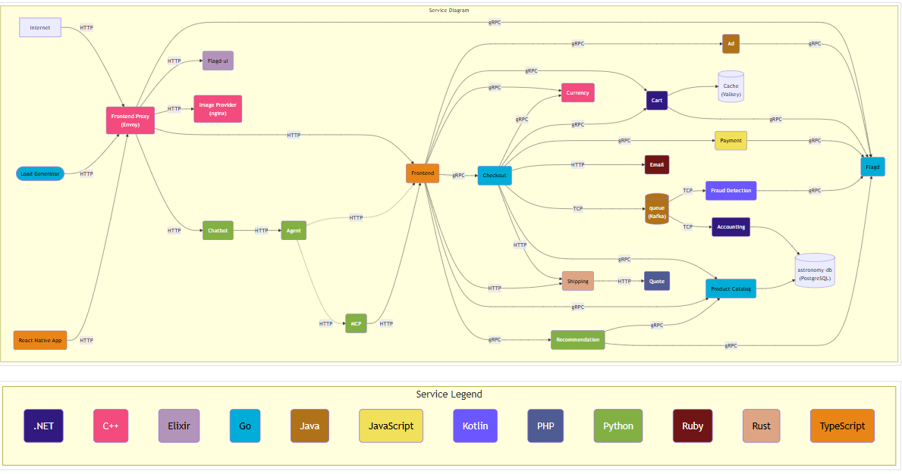

# Production-Grade OpenTelemetry E-Commerce Platform on AWS EKS

> I took the official OpenTelemetry e-commerce demo and transformed it into a complete **production-grade** platform on AWS. Below is everything I implemented end-to-end:

---

## Architecture

## What I Built / Key Features

Below is everything I implemented end-to-end:

### Infrastructure & AWS Setup
- Designed and created IAM users and IAM roles with least privilege
- Launched and configured EC2 instances
- Created and hardened Security Groups with proper inbound/outbound rules
- Fully automated infrastructure using Terraform:
  - VPC, Subnets, Internet Gateway, NAT Gateway
  - EKS Cluster with managed node groups
  - IAM roles for EKS, nodes, and service accounts
  - Route53 hosted zone and DNS records
  - Remote backend (S3 + DynamoDB) for Terraform state with state locking

### Containerization & Local Development
- Containerized all microservices using Docker
- Created multi-service `docker-compose.yml` for local development and testing
- Built and ran the complete application locally using Docker Compose
- Verified all services and inter-service communication locally

### Kubernetes
- Wrote production-ready Kubernetes manifests:
  - Deployments (with resource requests/limits and high availability)
  - Services
  - Ingress resources
  - PersistentVolumes and PersistentVolumeClaims
  - StorageClass
- Installed and configured NGINX Ingress Controller
- Deployed the entire application on EKS
- Verified all pods, services, and networking

### Networking & Domain
- Configured custom domain
- Set up Route53 records pointing to the EKS Ingress
- Configured Ingress with the custom domain

### GitOps & CI/CD
- Installed and configured ArgoCD
- Converted the project into a full GitOps model
- Deployed the entire application using ArgoCD
- Implemented CI pipeline using GitHub Actions for microservices
- Built a complete end-to-end CI/CD pipeline (GitHub Actions → ArgoCD)

### Observability
- Fully instrumented the application with **OpenTelemetry**
- Deployed and configured:
  - OpenTelemetry Collector
  - Prometheus
  - Grafana
  - Jaeger
- Created dashboards and verified distributed tracing, metrics, and logs
  
## Tech Stack

| Category                   | Technologies                                      |
|----------------------------|---------------------------------------------------|
| **Cloud Provider**         | AWS (EKS, EC2, IAM, VPC, Route53, S3, DynamoDB)   |
| **Infrastructure as Code** | Terraform                                         |
| **Containerization**       | Docker, Docker Compose                            |
| **Orchestration**          | Kubernetes (EKS)                                  |
| **Ingress**                | AWS Load Balancer Controller                      |
| **GitOps**                 | ArgoCD                                            |
| **CI/CD**                  | GitHub Actions                                    |
| **Observability**          | OpenTelemetry, Prometheus, Grafana, Jaeger        |

